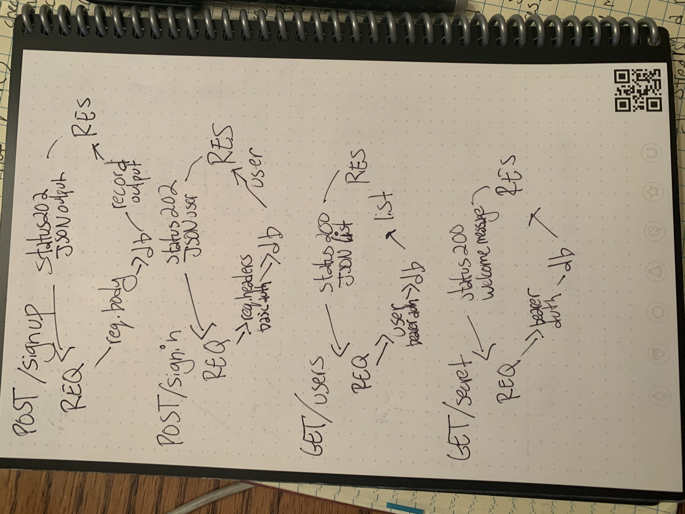

# LAB 7

## Project: BEARER AUTH

### Author: Sara Strasner

### Links and Resources

- [Latest PR](https://github.com/sarastrasner/bearer-auth/pull/6)
- [ci/cd](https://github.com/sarastrasner/bearer-auth/actions)
- [front-end application](https://sarastrasner-bearer-auth.herokuapp.com/) 

### Setup

#### `.env` requirements (where applicable)

- MONGODB_URI=mongodb://localhost:27017/auth
- PORT=3000
- SECRET=BANANAS
- ISSUER=SARA

#### How to initialize/run your application (where applicable)

- e.g. `npm start`

#### Tests

- The tests all run via jest in the terminal.
- All tests are passing.

#### UML
